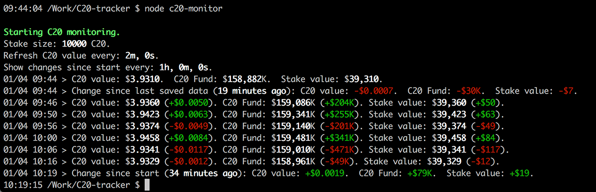

# C20 Monitor
C20 Monitor is a command-line interface app that monitors the C20 Crypto index fund and print out changes to the token value, fund size, and individual stake.

On exit, the app will print out the changes to the NAV, Fund, and Stake size since the start of the app.



## Requirements
1. Node 6+

## Usage
1. Clone the git repo
2. Run `npm install` in the repo folder
3. Run `node c20-monitor`. This will start the app with default argument values (see below).
4. Exit the app with the `ESC` key or `ctrl + c`

## Starting with custom values
The monitor takes up to 3 parameters:
`node c20-monitor [STAKE_SIZE] [UPDATE_INTERVAL_IN_SECONDS] [CHANGE_INTERVAL_IN_SECONDS]`

You can also specify specific parameters to set with arguments:
`node c20-monitor -stake 10000 -time 60 -change 300`

Argument | Default | Description
------------ | ------------- | -------------
`[STAKE_SIZE]` or `-stake [VALUE]` | 10000 | This is the size of the stake to monitor.
`[UPDATE_INTERVAL_IN_SECONDS]` or `-time [VALUE]` | 120 seconds | This is C20 token value update frequency in seconds.
`[CHANGE_INTERVAL_IN_SECONDS]` or `-change [VALUE]` | 3600s (1h) | This is frequency in seconds when to show the changes since start.

## Using a config file
Creating a `config.json` file into the root folder will allow setting these values without having to provide them each time.
Example:
```javascript
{
  "stake": 15000.2501,
  "updateInterval": 120000,
  "changeInterval": 36000000
}
```

## Stored data
Each time the app refreshes the data from C20 servers, it stores the NAV, C20 Fund size, and the timetamp into a separate `data.json` file.

Starting the app with this file in the same folder will print out the changes since that saved date.